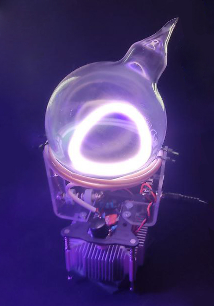
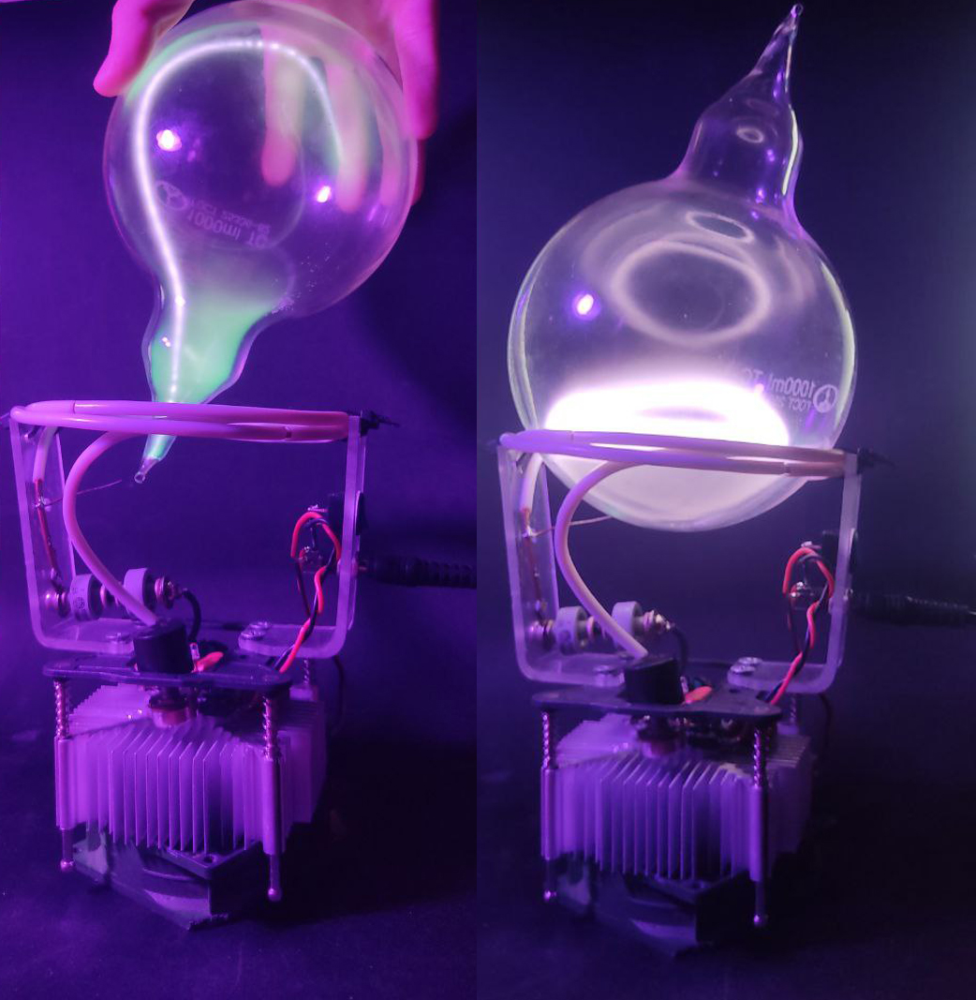
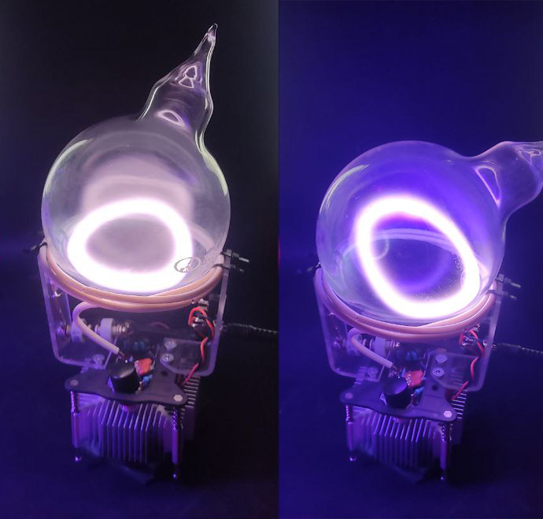
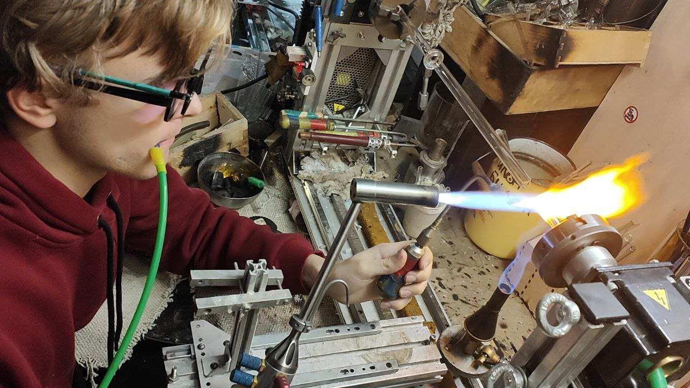
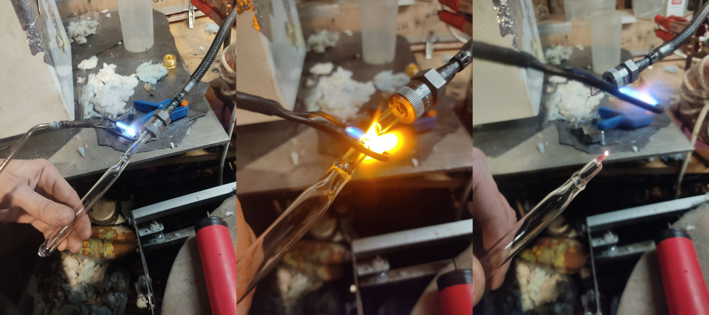
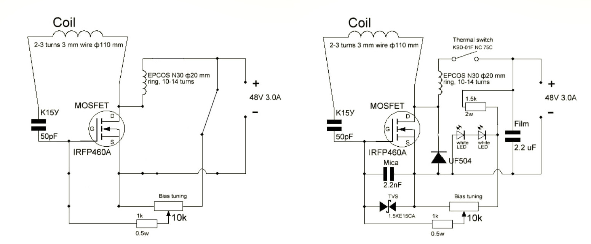

# Генератор тороидальной индуктивно-связанной плазмы

🏆 **Диплом первой степени** в секции физики с работой *"Определение направлений развития технологии плазменных скульптур"* на конференции XXXIV Сахаровские чтения (2024).

Этот проект — комплексное аппаратно-физическое исследование (R&D), в рамках которого была решена инженерная задача по оптимизации плазменных установок. 

  
   

*Работающая установка с тороидальной индуктивно-свяханной плазмой внутри*

### Суть проекта простыми словами
Плазменные скульптуры — это сложные устройства, где внутри стеклянной колбы с разреженным газом под воздействием электромагнитных полей создается светящаяся плазма. 
Самый впечатляющий вид плазмы — **индуктивно-связанная (ИСП)** [^1] в форме тороида (яркого светящегося кольца), которая имеет огромную температуру, позволяющую расщеплять соли металлов для создания разных цветов.

**Проблема:** Классическая схема требовала **двух независимых генераторов**: один для начального "поджига" газа (емкостно-связанная плазма), второй — для поддержания кольцевого свечения (индуктивно-связанная плазма). Это усложняло конструкцию, снижало надежность и удорожало производство (да и было просто некрасиво😁).
**Решение:** Путем физического моделирования и проведения серии экспериментов я доказал гипотезу, позволившую инициировать и поддерживать плазму **всего одним генератором**. Я разработал, собрал и протестировал пилотный образец, готовый к серийному производству.

---

### 🛠 Примененные навыки

В ходе работы над этим проектом я прошел полный путь R&D:

* **Математическое моделирование и анализ динамики:** Использовал аппарат дифференциальных уравнений для расчета волновых процессов в "длинных линиях" и моделирования электромагнитной индукции (законы Максвелла, Фарадея). Проводил расчеты высокодобротных RLC-контуров и резонансных частот.
* **Работа с электроникой:** Самостоятельно собирал и отлаживал гармонические транзисторные автогенераторы. Знаком с принципами работы электроники, осциллографами и базовой схемотехникой.
* **Тестирование и проверка гипотез:** Разрабатывал методики экспериментов. Проводил интеграционное тестирование различных компонентов системы (влияние формы колб, газовых смесей, длины катушек) для достижения стабильной работы.
* **Анализ производственной цепочки:** Разобрался в цепочке сборки установок на производстве. Выявил ключевые направления для оптимизации производственной цепочки. 
* **Техническая документация и Research:** Проводил ресёрч англо- и русскоязычной литературы по физике плазмы. По итогам написал подробный технический отчет с описанием физических процессов, математическим обоснованием и выводами.

---

### 🎞️ Галерея процесса и результатов работ

*Модифицированный генератор способен генерировать как емкостно-связанную (слева), так и индуктивно-связанную тороидальную плазму (справа).*

*Индуктивно-связанная плазма обладает высокой температурой, что позволяет расщеплять соли для получения уникальных визуальных эффектов. Слева — свечение чистого ксенона, справа — фиолетовое свечение, вызванное добавлением паров фторида стронция.*

*Создание геометрии: работа на специальном стеклодувном станке для придания колбам из боросиликатного стекла формы, необходимой для правильного распределения давления.*

*Запаивание колбы после откачивания воздуха вакуумным насосом и заправки инертными газами (неон, ксенон) до нужного давления (10-50 торр).*

*Слева — упрощенная схема генератора, обеспечивающая математические условия самовозбуждения. Справа — полная принципиальная схема устройства.*

---

### 📚 Источники

[^1]: Hopwood, J. "Review of inductively coupled plasmas for plasma processing." Plasma Sources Science and Technology 1.2 (1992): 109-116.
